# Entity Relationship Diagram (ERD) & Database Schema
## Platform: HUMIND (Human – Mind)
**Dokumen Referensi:** Product Requirements Document (PRD) v1.4.0  
**Target Rilis:** MVP Fase 1 (Web-First, PWA-Ready)  
**Database Engine:** PostgreSQL 15+ (Supabase Native dengan Row-Level Security)  
**File Target Repositori GitHub:** `docs/database.skema.erd.md`

---

## 1. Visual Entity Relationship Diagram (Mermaid)

```mermaid
erDiagram
    %% Hubungan Profil & Autentikasi
    AUTH_USERS ||--|| PROFILES : "extends (1:1)"
    PROFILES ||--o| PSYCHOLOGIST_PROFILES : "has psychologist role (0..1)"
    PROFILES ||--o{ COUNSELING_ORDERS : "orders packages"
    PROFILES ||--o{ MOOD_LOGS : "logs daily emotion"
    PROFILES ||--o{ CHAT_MESSAGES : "sends messages"

    %% Hubungan Psikolog & Spesialisasi
    PSYCHOLOGIST_PROFILES ||--o{ PSYCHOLOGIST_SPECIALTIES : "possesses"
    SPECIALTIES ||--o{ PSYCHOLOGIST_SPECIALTIES : "categorizes"
    PSYCHOLOGIST_PROFILES ||--o{ PSYCHOLOGIST_SCHEDULES : "defines recurring slots"
    PSYCHOLOGIST_PROFILES ||--o{ COUNSELING_SESSIONS : "attends session"
    PSYCHOLOGIST_PROFILES ||--o{ SESSION_SUMMARIES : "creates clinical notes"

    %% Hubungan Transaksi & Pemesanan
    COUNSELING_PACKAGES ||--o{ COUNSELING_ORDERS : "selected in"
    COUNSELING_ORDERS ||--o{ TRANSACTIONS : "billed via"
    COUNSELING_ORDERS ||--o{ COUNSELING_SESSIONS : "allocates quota to"

    %% Hubungan Ruang Konseling & Interaksi
    COUNSELING_SESSIONS ||--o| SESSION_SUMMARIES : "documented by (1:1)"
    COUNSELING_SESSIONS ||--o{ CHAT_MESSAGES : "contains consultation chats"

    PROFILES {
        uuid id PK "FK auth.users.id"
        string email UK "Email resmi pengguna"
        string legal_full_name "Nama legal (verifikasi/administrasi)"
        string alias_name "Nama samaran (Mode Curhat Anonim)"
        string phone_number "Nomor kontak darurat"
        user_role role "client | psychologist | admin"
        timestamptz created_at
        timestamptz updated_at
    }

    PSYCHOLOGIST_PROFILES {
        uuid id PK "UUID psikolog"
        uuid user_id FK "UK -> profiles.id"
        string full_name_with_title "Nama lengkap beserta gelar profesi"
        string sipp_number UK "Nomor Surat Izin Praktik Psikologi (Wajib)"
        text bio_summary "Biografi dan riwayat klinis"
        string avatar_url "Foto resmi profesional"
        numeric rating_avg "Rata-rata kepuasan klien (1.00 - 5.00)"
        int total_reviews "Total ulasan yang diterima"
        boolean is_active "Status menerima klien (Active / Beristirahat)"
        timestamptz created_at
        timestamptz updated_at
    }

    SPECIALTIES {
        uuid id PK "UUID spesialisasi"
        string slug UK "Slug 6 masalah mahasiswa"
        string display_name "Nama ramah mahasiswa"
        text description "Penjelasan konteks masalah"
        timestamptz created_at
    }

    PSYCHOLOGIST_SPECIALTIES {
        uuid psychologist_id PK, FK "FK -> psychologist_profiles.id"
        uuid specialty_id PK, FK "FK -> specialties.id"
    }

    PSYCHOLOGIST_SCHEDULES {
        uuid id PK "UUID jadwal template"
        uuid psychologist_id FK "FK -> psychologist_profiles.id"
        int day_of_week "1 (Senin) - 7 (Minggu)"
        time start_time "Waktu mulai sesi"
        time end_time "Waktu berakhir (60m + 15m jeda buffer)"
        boolean is_active "Status slot template aktif"
    }

    COUNSELING_PACKAGES {
        uuid id PK "UUID paket"
        counseling_method counseling_method "chat | call | video"
        int session_count "1 | 2 | 4 sesi"
        int duration_minutes "Terkunci 60 menit"
        numeric original_price_idr "Harga normal paket"
        numeric discount_percentage "Diskon bundling (0%, 10%, 20%)"
        numeric final_price_idr "Harga final setelah potongan"
        boolean is_active "Status ketersediaan paket"
        timestamptz created_at
    }

    COUNSELING_ORDERS {
        uuid id PK "UUID order pemesanan"
        string order_number UK "Format: ORD-YYYYMM-XXXX"
        uuid user_id FK "FK -> profiles.id"
        uuid package_id FK "FK -> counseling_packages.id"
        int total_sessions "Jumlah sesi dibeli (1, 2, atau 4)"
        int used_sessions "Sesi yang sudah dijadwalkan/selesai"
        int remaining_sessions "Sisa kuota aktif di akun"
        order_status order_status "pending_payment | paid | completed | cancelled | expired"
        timestamptz created_at
        timestamptz updated_at
    }

    TRANSACTIONS {
        uuid id PK "UUID transaksi"
        uuid order_id FK "FK -> counseling_orders.id"
        string payment_gateway_ref "Invoice ID Payment Gateway"
        string payment_method "QRIS | VA_BCA | VA_MANDIRI dll"
        numeric gross_amount_idr "Nominal tagihan bruto"
        payment_status payment_status "pending | paid | failed | expired | refunded"
        string payment_url "Tautan pembayaran eksternal"
        string qr_payload "Payload kode QRIS dinamis"
        timestamptz expires_at "Batas waktu bayar (15 menit)"
        timestamptz paid_at "Waktu callback pembayaran sukses"
        jsonb raw_response "Log respons callback webhook"
        timestamptz created_at
        timestamptz updated_at
    }

    COUNSELING_SESSIONS {
        uuid id PK "UUID sesi konsultasi"
        uuid order_id FK "FK -> counseling_orders.id"
        uuid psychologist_id FK "FK -> psychologist_profiles.id"
        int session_number "Nomor sesi dari paket (1, 2, 3, 4)"
        date scheduled_date "Tanggal reservasi sesi"
        time start_time "Jam mulai sesi"
        time end_time "Jam berakhir sesi (60 menit)"
        identity_mode identity_mode "real_name | anonymous"
        string client_display_name "Snapshot identitas yang ditampilkan di room"
        session_status session_status "locked | scheduled | ongoing | completed | cancelled | no_show"
        timestamptz lock_expires_at "Waktu batas penguncian slot (15 menit)"
        string webrtc_room_id UK "ID ruangan unik WebRTC / Provider"
        int rating_score "Rating evaluasi klien (1 - 5)"
        text rating_review "Ulasan pengalaman konseling"
        timestamptz created_at
        timestamptz updated_at
    }

    SESSION_SUMMARIES {
        uuid id PK "UUID rangkuman"
        uuid session_id FK "UK -> counseling_sessions.id"
        uuid psychologist_id FK "FK -> psychologist_profiles.id"
        text key_takeaways "Poin utama hasil konseling"
        text action_plan "Rencana aksi pemulihan mental"
        text coping_homework "Latihan mandiri mahasiswa"
        boolean recommended_follow_up "Rekomendasi sesi lanjutan"
        timestamptz created_at
        timestamptz updated_at
    }

    CHAT_MESSAGES {
        uuid id PK "UUID pesan"
        uuid session_id FK "FK -> counseling_sessions.id"
        uuid sender_id FK "FK -> profiles.id"
        text message_body_enc "Isi teks terenkripsi (AES / WSS Secure)"
        boolean is_crisis_alert "Tanda pemicu protokol darurat SEJIWA 119"
        timestamptz sent_at "Waktu pengiriman pesan"
    }

    MOOD_LOGS {
        uuid id PK "UUID catatan mood"
        uuid user_id FK "FK -> profiles.id"
        int mood_score "Skala 1 (Burnout) s/d 5 (Stabil)"
        jsonb trigger_tags "Array tags pemicu [#Skripsi, #UangKos]"
        boolean habit_water "Centang minum air 2L"
        boolean habit_screen_break "Centang rehat layar 15 menit"
        boolean habit_breathing "Centang box breathing 2 menit"
        text notes "Catatan reflektif mandiri singkat"
        timestamptz logged_at "Waktu check-in mood"
    }
```

---

## 2. Pemetaan Komprehensif Skema terhadap Ketentuan PRD Humind v1.4.0

| Modul PRD | Ketentuan Bisnis PRD | Implementasi Tabel & Atribut | Validasi & Integritas Basis Data |
| :--- | :--- | :--- | :--- |
| **Fitur 1.1: Mode Curhat Anonim (Safe Haven)** | Pemisahan identitas legal vs identitas ruang konseling. Nama asli tidak boleh bocor ke psikolog saat mode anonim aktif. | `profiles.legal_full_name`, `profiles.alias_name`, `counseling_sessions.identity_mode`, `counseling_sessions.client_display_name` | Saat booking dibuat, nilai snapshot `client_display_name` diisi dengan `alias_name` bila `identity_mode = 'anonymous'`, sehingga UI psikolog hanya merender nama alias. |
| **Fitur 1.2: Direktori Psikolog & Legalitas SIPP** | Nomor SIPP wajib terverifikasi. Filter direktori menggunakan 6 kategori masalah mahasiswa. | `psychologist_profiles.sipp_number`, `specialties.slug`, tabel pivot `psychologist_specialties` | `sipp_number` memiliki constraint `UNIQUE NOT NULL`. 6 slug master ditanamkan di seed data: `burnout-tugas`, `kecemasan-finansial`, `insomnia-overthinking`, `toxic-circle`, `krisis-arah-karir`, `insecurity-krisis-pd`. |
| **Fitur 1.3: Kalkulator Layanan Dinamis** | Durasi sesi dikunci tetap 60 menit. Metode Chat, Call, Video Call. Pilihan 1, 2, 4 sesi dengan diskon bundling otomatis. | `counseling_packages.duration_minutes`, `counseling_packages.session_count`, `counseling_packages.discount_percentage` | Check constraint `duration_minutes = 60` dan `session_count IN (1, 2, 4)`. Harga paket coret dan harga final dihitung otomatis. |
| **Fitur 1.3: Manajemen Kuota Multi-Sesi** | Paket 2 dan 4 sesi menyimpan sisa sesi sebagai kuota aktif untuk dijadwalkan nanti via "Jadwal Saya". | `counseling_orders.total_sessions`, `counseling_orders.used_sessions`, `counseling_orders.remaining_sessions` | Constraint `used_sessions + remaining_sessions = total_sessions`. Penjadwalan sesi baru memotong `remaining_sessions`. |
| **Fitur 1.3: Zero Double-Booking & Slot Hold** | Mencegah jadwal ganda psikolog dan mengunci slot selama 15 menit sebelum pembayaran lunas. | `counseling_sessions.uq_psychologist_slot`, `counseling_sessions.lock_expires_at`, `counseling_sessions.session_status` | `CONSTRAINT uq_psychologist_slot UNIQUE (psychologist_id, scheduled_date, start_time)` memastikan integritas database tidak mengizinkan pemesanan ganda pada detik yang sama. |
| **Fitur 1.4: Payment Gateway (QRIS & VA)** | Batas transfer 15 menit, verifikasi via callback webhook, status transaksi real-time. | `transactions.gross_amount_idr`, `transactions.expires_at`, `transactions.payment_status`, `transactions.payment_gateway_ref` | `expires_at` disetel `NOW() + INTERVAL '15 minutes'`. Status diperbarui via webhook menjadi `paid` atau `expired`. |
| **Fitur 1.5: Ruang Telekonseling Terpadu & Realtime Chat** | Ruang sesi terpadu Video/Voice/Chat, countdown 60m, enkripsi data, dan rangkuman pasca-konseling. | `counseling_sessions.webrtc_room_id`, `chat_messages.message_body_enc`, `session_summaries` | Enkripsi payload chat pada kolom `message_body_enc`. Satu sesi menghasilkan 1 catatan evaluasi klinis resmi pada `session_summaries`. |
| **Fitur 1.6: SOP Krisis Darurat & SEJIWA 119** | Penanganan cepat indikasi krisis akut (*suicidal ideation* / *self-harm*). | `chat_messages.is_crisis_alert` | Flag `is_crisis_alert = true` memicu antarmuka menampilkan kartu rujukan SEJIWA 119 ext 8 dan hotline krisis LISA. |
| **Fitur 1.8: Daily Wellness (Mood Tracker & Habit)** | Check-in mood < 15 detik (skala 1-5), tag pemicu mahasiswa, dan 3 micro-habit harian. | `mood_logs.mood_score`, `mood_logs.trigger_tags`, `mood_logs.habit_water`, `mood_logs.habit_screen_break`, `mood_logs.habit_breathing` | Skala `mood_score CHECK (mood_score BETWEEN 1 AND 5)`. Tag konteks disimpan fleksibel dalam kolom `JSONB` array. |

---

## 3. Kamus Data & Spesifikasi Kolom (Data Dictionary)

### 3.1. Tabel `profiles`
*Menyimpan data identitas pengguna yang terhubung langsung dengan Supabase Authentication.*

| Nama Kolom | Tipe Data | Constraint | Keterangan |
| :--- | :--- | :--- | :--- |
| `id` | `UUID` | `PRIMARY KEY`, `REFERENCES auth.users(id)` | ID unik pengguna dari Supabase Auth |
| `email` | `TEXT` | `UNIQUE`, `NOT NULL` | Alamat surel aktif |
| `legal_full_name` | `TEXT` | `NOT NULL` | Nama lengkap untuk verifikasi administratif |
| `alias_name` | `TEXT` | `NULLABLE` | Nama samaran untuk Mode Curhat Anonim |
| `phone_number` | `TEXT` | `NULLABLE` | Nomor telepon/WhatsApp untuk kontak darurat |
| `role` | `user_role` | `NOT NULL`, `DEFAULT 'client'` | Nilai: `'client'`, `'psychologist'`, `'admin'` |
| `created_at` | `TIMESTAMPTZ`| `NOT NULL`, `DEFAULT NOW()` | Waktu pembuatan akun |
| `updated_at` | `TIMESTAMPTZ`| `NOT NULL`, `DEFAULT NOW()` | Waktu pembaruan profil |

### 3.2. Tabel `psychologist_profiles`
*Menyimpan profil profesional, legalitas SIPP, dan metrik layanan psikolog mitra.*

| Nama Kolom | Tipe Data | Constraint | Keterangan |
| :--- | :--- | :--- | :--- |
| `id` | `UUID` | `PRIMARY KEY`, `DEFAULT gen_random_uuid()` | ID unik entitas psikolog |
| `user_id` | `UUID` | `UNIQUE`, `NOT NULL`, `REFERENCES profiles(id)` | Akun profil tertaut |
| `full_name_with_title` | `TEXT` | `NOT NULL` | Nama lengkap beserta gelar (contoh: *Farida, M.Psi., Psikolog*) |
| `sipp_number` | `TEXT` | `UNIQUE`, `NOT NULL` | Nomor Surat Izin Praktik Psikologi resmi |
| `bio_summary` | `TEXT` | `NULLABLE` | Biografi singkat dan pengalaman kasus |
| `avatar_url` | `TEXT` | `NULLABLE` | URL foto profil profesional |
| `years_of_experience` | `INT` | `DEFAULT 0` | Lama pengalaman praktik (dalam tahun) |
| `rating_avg` | `NUMERIC(3,2)` | `DEFAULT 5.00` | Rating akumulasi (skala 1.00 s/d 5.00) |
| `total_reviews` | `INT` | `DEFAULT 0` | Jumlah akumulasi ulasan klien |
| `is_active` | `BOOLEAN` | `NOT NULL`, `DEFAULT true` | Menandakan kesiapan menerima konsultasi |
| `created_at` | `TIMESTAMPTZ`| `NOT NULL`, `DEFAULT NOW()` | Waktu profil dibuat |
| `updated_at` | `TIMESTAMPTZ`| `NOT NULL`, `DEFAULT NOW()` | Waktu profil diubah |

### 3.3. Tabel `specialties` & `psychologist_specialties`
*Daftar spesialisasi bahasa manusia khas mahasiswa dan pemetaannya ke psikolog (Many-to-Many).*

| Nama Kolom | Tipe Data | Constraint | Keterangan |
| :--- | :--- | :--- | :--- |
| `id` | `UUID` | `PRIMARY KEY`, `DEFAULT gen_random_uuid()` | ID spesialisasi |
| `slug` | `TEXT` | `UNIQUE`, `NOT NULL` | Kode unik URL (contoh: `burnout-tugas`) |
| `display_name` | `TEXT` | `NOT NULL` | Nama tampilan (contoh: *Burnout Tugas & Akademik*) |
| `description` | `TEXT` | `NULLABLE` | Penjelasan isu masalah |

### 3.4. Tabel `counseling_packages`
*Daftar paket layanan telekonseling dengan durasi tetap 60 menit dan kalkulasi diskon bundling otomatis.*

| Nama Kolom | Tipe Data | Constraint | Keterangan |
| :--- | :--- | :--- | :--- |
| `id` | `UUID` | `PRIMARY KEY`, `DEFAULT gen_random_uuid()` | ID paket |
| `counseling_method`| `counseling_method`| `NOT NULL` | Nilai: `'chat'`, `'call'`, `'video'` |
| `session_count` | `INT` | `NOT NULL`, `CHECK (session_count IN (1, 2, 4))` | Jumlah sesi: 1, 2, atau 4 |
| `duration_minutes` | `INT` | `NOT NULL`, `DEFAULT 60`, `CHECK (duration_minutes = 60)` | Durasi sesi dikunci 60 menit |
| `original_price_idr`| `NUMERIC(12,2)`| `NOT NULL` | Harga normal paket (harga coret) |
| `discount_percentage`| `NUMERIC(5,2)`| `NOT NULL`, `DEFAULT 0.00` | Persentase diskon bundling (> 1 sesi) |
| `final_price_idr` | `NUMERIC(12,2)`| `NOT NULL` | Harga yang wajib dibayarkan klien |
| `is_active` | `BOOLEAN` | `NOT NULL`, `DEFAULT true` | Status paket dapat dipesan |

### 3.5. Tabel `counseling_orders`
*Mencatat pesanan paket konseling dan sisa kuota sesi pengguna.*

| Nama Kolom | Tipe Data | Constraint | Keterangan |
| :--- | :--- | :--- | :--- |
| `id` | `UUID` | `PRIMARY KEY`, `DEFAULT gen_random_uuid()` | ID pesanan |
| `order_number` | `TEXT` | `UNIQUE`, `NOT NULL` | Kode invoice unik (contoh: `ORD-202609-0012`) |
| `user_id` | `UUID` | `NOT NULL`, `REFERENCES profiles(id)` | Akun mahasiswa pembeli |
| `package_id` | `UUID` | `NOT NULL`, `REFERENCES counseling_packages(id)` | Paket yang dipilih |
| `total_sessions` | `INT` | `NOT NULL`, `CHECK (total_sessions IN (1, 2, 4))` | Total kuota sesi yang didapatkan |
| `used_sessions` | `INT` | `NOT NULL`, `DEFAULT 0` | Jumlah sesi yang telah dijadwalkan/selesai |
| `remaining_sessions`| `INT` | `NOT NULL` | Sisa kuota sesi aktif di akun |
| `order_status` | `order_status`| `NOT NULL`, `DEFAULT 'pending_payment'` | Status order (`pending_payment`, `paid`, dll.) |

### 3.6. Tabel `counseling_sessions`
*Mencatat sesi konsultasi terjadwal, penguncian slot 15 menit, mode anonim, dan tautan WebRTC.*

| Nama Kolom | Tipe Data | Constraint | Keterangan |
| :--- | :--- | :--- | :--- |
| `id` | `UUID` | `PRIMARY KEY`, `DEFAULT gen_random_uuid()` | ID sesi konsultasi |
| `order_id` | `UUID` | `NOT NULL`, `REFERENCES counseling_orders(id)` | Tiket pesanan asal |
| `psychologist_id` | `UUID` | `NOT NULL`, `REFERENCES psychologist_profiles(id)` | Psikolog terpilih |
| `session_number` | `INT` | `NOT NULL`, `DEFAULT 1` | Sesi ke-1, 2, 3, atau 4 |
| `scheduled_date` | `DATE` | `NOT NULL` | Tanggal kalender konseling |
| `start_time` | `TIME` | `NOT NULL` | Waktu mulai sesi |
| `end_time` | `TIME` | `NOT NULL` | Waktu berakhir sesi (durasi 60 menit) |
| `identity_mode` | `identity_mode` | `NOT NULL`, `DEFAULT 'anonymous'` | Pilihan: `'real_name'` atau `'anonymous'` |
| `client_display_name`| `TEXT`| `NOT NULL` | Snapshot nama yang tampil di room |
| `session_status` | `session_status`| `NOT NULL`, `DEFAULT 'locked'` | Status: `locked`, `scheduled`, `ongoing`, `completed` |
| `lock_expires_at`| `TIMESTAMPTZ` | `NULLABLE` | Batas waktu penguncian slot (15 menit) |
| `webrtc_room_id` | `TEXT` | `UNIQUE`, `NULLABLE` | ID room provider WebRTC (LiveKit/Agora) |
| `rating_score` | `INT` | `CHECK (rating_score BETWEEN 1 AND 5)` | Evaluasi kepuasan klien setelah sesi |
| `rating_review` | `TEXT` | `NULLABLE` | Masukan pengalaman konsultasi |
| *Constraint Khusus*| `UNIQUE` | `(psychologist_id, scheduled_date, start_time)` | **Pencegahan mutlak double-booking** |

### 3.7. Tabel `session_summaries`
*Mencatat rangkuman pasca-konseling yang wajib diisi oleh psikolog.*

| Nama Kolom | Tipe Data | Constraint | Keterangan |
| :--- | :--- | :--- | :--- |
| `id` | `UUID` | `PRIMARY KEY`, `DEFAULT gen_random_uuid()` | ID rangkuman klinis |
| `session_id` | `UUID` | `UNIQUE`, `NOT NULL`, `REFERENCES counseling_sessions(id)` | Sesi konsultasi terkait |
| `psychologist_id` | `UUID` | `NOT NULL`, `REFERENCES psychologist_profiles(id)` | Psikolog yang mengisi catatan |
| `key_takeaways` | `TEXT` | `NOT NULL` | Rangkuman poin kunci masalah |
| `action_plan` | `TEXT` | `NOT NULL` | Rencana aksi pemulihan (*coping plan*) |
| `coping_homework` | `TEXT` | `NULLABLE` | Latihan mandiri yang disarankan |
| `recommended_follow_up`| `BOOLEAN`| `DEFAULT false` | Perlunya konsultasi lanjutan |

### 3.8. Tabel `mood_logs`
*Mencatat pelacakan emosi harian (< 15 detik) dan kebiasaan koping mikro.*

| Nama Kolom | Tipe Data | Constraint | Keterangan |
| :--- | :--- | :--- | :--- |
| `id` | `UUID` | `PRIMARY KEY`, `DEFAULT gen_random_uuid()` | ID catatan mood |
| `user_id` | `UUID` | `NOT NULL`, `REFERENCES profiles(id)` | Pengguna pemilik catatan |
| `mood_score` | `INT` | `NOT NULL`, `CHECK (mood_score BETWEEN 1 AND 5)` | Skala 1 (Burnout) s/d 5 (Stabil) |
| `trigger_tags` | `JSONB` | `NOT NULL`, `DEFAULT '[]'::jsonb` | Tag pemicu (`#Skripsi`, `#UangKos`, dll.) |
| `habit_water` | `BOOLEAN` | `DEFAULT false` | Checklist hidrasi 2L |
| `habit_screen_break`| `BOOLEAN` | `DEFAULT false` | Checklist istirahat layar 15m |
| `habit_breathing` | `BOOLEAN` | `DEFAULT false` | Checklist box breathing 2m |
| `notes` | `TEXT` | `NULLABLE` | Catatan reflektif mandiri |
| `logged_at` | `TIMESTAMPTZ`| `NOT NULL`, `DEFAULT NOW()` | Waktu pencatatan |